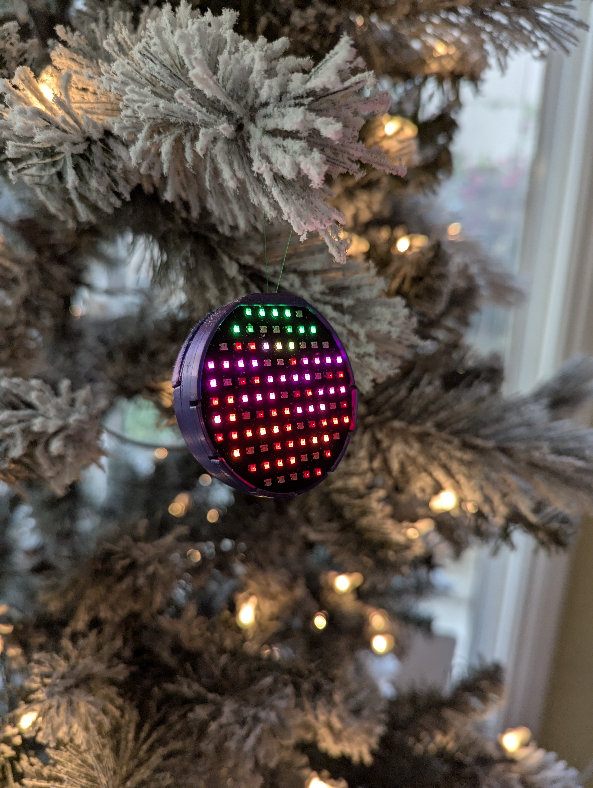

# WledOrnament2024
My Christmas present for family
## Instructions
Default behavior is to shuffle all the presets.
Single button press will cycle each preset in order and stay on that preset.
Double button press will go back to shuffling the presets.
Long button press will turn off the display but leave the micro on.

Taking off the back of the ornament starts by holding it from the bottom and
squeezing the corners of the lid with one hand, while pulling at the tab on 
top with the other hand.
To put the lid back on start with the tab and slot it into the groove, then
squeeze the corners of the lid while pushing it back into place.

### Notes for improvement
buttons should be located around the edges 
I want to use soft power to turn on and off the whole device instead of a switch
